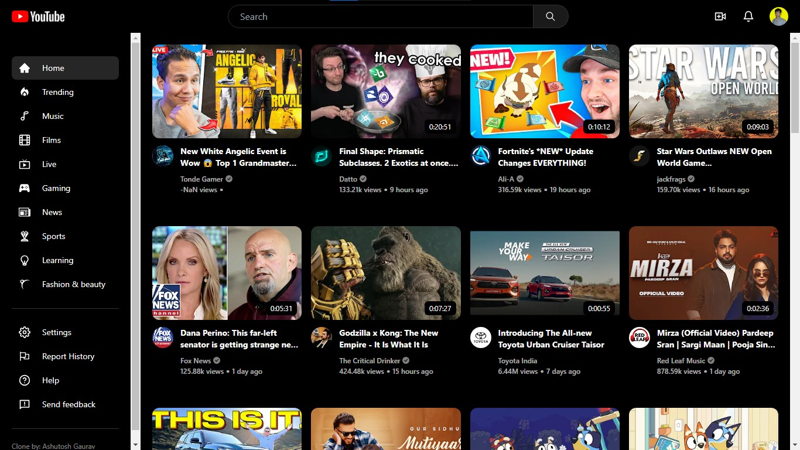

<div align="center"></div>
<h1 align="center"> YouTube Clone</h1>
This is a YouTube clone project developed using JavaScript and various libraries and APIs to mimic the functionalities of the popular video-sharing platform YouTube.

### Click to <a href="https://gaurav-youtube.netlify.app/" target="_blank"> Visit </a>

<br />
<div align="center"> <a href="https://gaurav-youtube.netlify.app/" target="_blank"> </a></div>
<br />


## Technologies Used

- JavaScript
- RapidAPI
- Axios
- HTML-React-Parser
- js-abbreviation-number
- Moment
- React
- React-Icons
- TailwindCSS
- React-Lazy-Load
- and more

## Features

- **Video browsing:** Users can browse through a collection of videos.
- **Search functionality:** Users can search for specific videos by keywords.
- **Video playback:** Users can watch videos within the application.
- **Responsive design:** The application is designed to be usable across different devices and screen sizes.
- **Lazy loading:** Videos are loaded dynamically as users scroll, improving performance.
- **Date formatting:** Dates are formatted using Moment.js for a better user experience.

## Installation

To run this project locally, follow these steps:

```bash
git clone https://github.com/as-ga/youtube-clone.git
cd youtube-clone
npm install
npm run dev
```

- Open your web browser and visit `http://localhost:5173` to view the application.

## Usage

Once the application is running, users can:

- Browse through available videos.
- Use the search bar to find specific videos.
- Click on a video to watch it.
- Interact with video controls such as play, pause, and seek.
- Enjoy a seamless video playback experience.

## Contributing

Contributions are welcome! If you'd like to contribute to this project, please follow these steps:

1. Fork the repository
2. Create your feature branch: `git checkout -b feature-name`
3. Commit your changes: `git commit -am 'Add some feature'`
4. Push to the branch: `git push origin feature-name`
5. Submit a pull request

## Contact

<p align="left"><a href="https://linkedin.com/in/ashutosh-li" target="blank"> </a></p>
